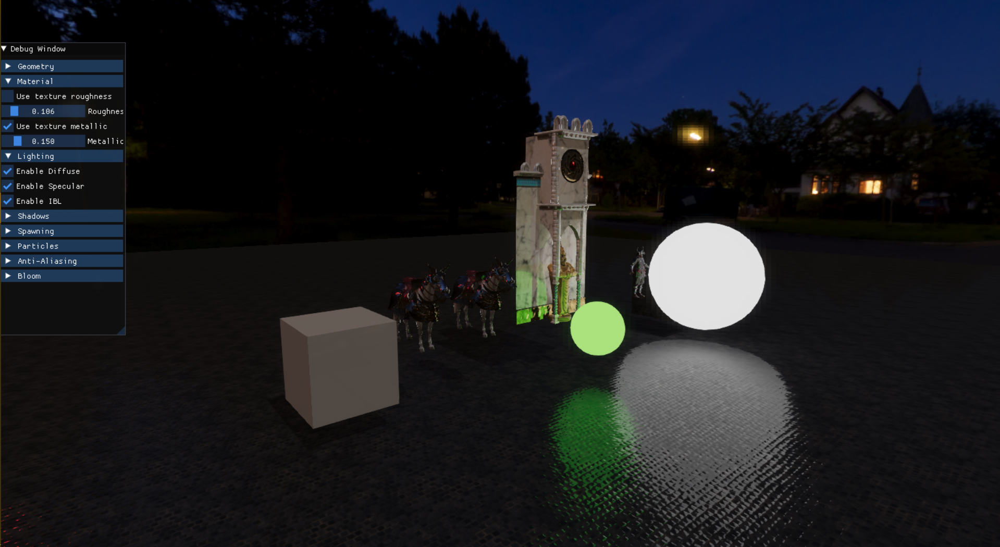

# LRNEngine

### Description
_This is my **LRNEngine**(LeaRNEngine) that I created in order to learn Compute Graphics and Rendering techniques as a part of my Dragons Lake Render Internship. The engine uses the `DirectX11` graphics API._

### Requirements
Everything already comes with the engine.
- `DirectX11`
- `assimp`
- `DirectXTex`
- `DirectXMath`
- `spdlog`
- `imgui`

### Instalation

_Download Repo with all the submodules._
```sh
git clone https://github.com/Adeon18/LRNEngine.git --recurse-submodules
```
You can manually connect `assimp` to be built with the engine, or(_recommended_) install `assimp` via `vcpkg`.

And you're done!

### Functionality
The engine implements the following rendering techniques:
- Camera, use `LMB` to rotate it and `WASD`, `Space` `Left Ctrl` to move
- Object dragging - `RMB` on model to drag it along the plane, parallel to camera
- Instanced Rendering
- Tesselation
- Model loading via `assimp`
- Debug normal and vireframe visualization via Geometry Shader
- Directional Lights, Point Lights
- Flashlight - press `F` to attach/deattach
- HDR and Aces Tonemapping
- PBR and IBL(Cubemaps are precomputed, to compute them yourself enable `BAKE_CUBEMAPS` in `include/config.hpp`
- NVidia FXAA 3.11
- Deferred Rendering
- Physically Based Bloom
- Decals that attach to models, press `G` to cast a decal at mouse pointer
- Model Spawn, press `N` to spawn a model in front of camera
- CPU particles, press `H` to spawn a smoke emitter that can be dragged with a mouse
- Model Destruction with GPU particles with lighting and screen space collision, press `Del` to destroy a model
- Imgui menu that can help dynamically configure a lot of the graphics and logic
- Logging with the help of a `spdlog` library

### Demo

https://github.com/Adeon18/LRNEngine/assets/56467999/291b64a6-4893-4b73-8003-ff1bcb304908


https://github.com/Adeon18/LRNEngine/assets/56467999/fbd78b9d-e04e-4e33-a8a8-fb4be5fc1ef8


https://github.com/Adeon18/LRNEngine/assets/56467999/c333c54a-0040-4310-bec1-42a4e0496ef3



